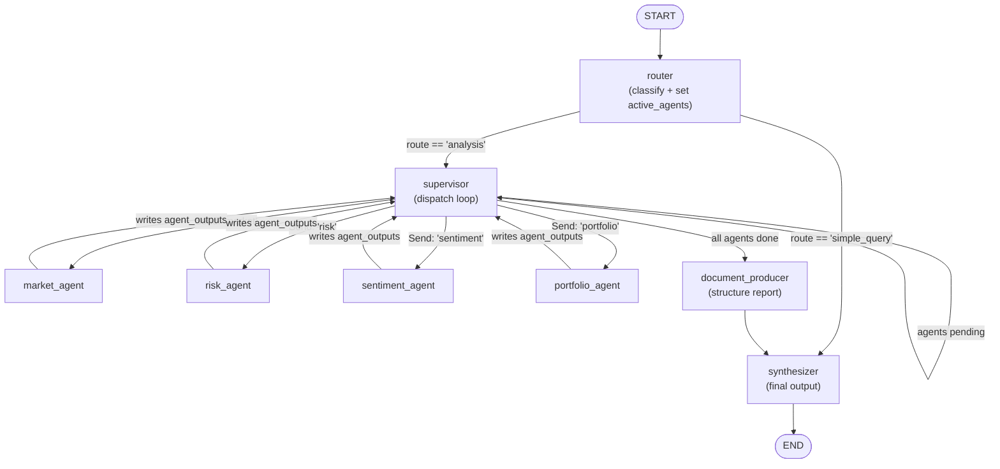

# Faheem — Fintech Multi-Agent Analysis System

> THE BEST TEAM AND PROJECT IN THE WORLD

A multi-agent financial analysis system built with **LangGraph** + **FastAPI**. Specialist agents analyze different financial dimensions in parallel and synthesize a unified response.

---

## Architecture



### Components

| Component | File | Role |
|---|---|---|
| **Router** | `app/graph/nodes/router.py` | Classifies query, selects which agents to invoke |
| **Supervisor** | `app/graph/nodes/supervisor.py` | Dispatches agents in parallel, tracks completion |
| **Analysis agents** | `app/graph/teams/analysis/` | Specialist sub-agents (market, risk, sentiment, portfolio) |
| **Document producer** | `app/graph/nodes/document_producer.py` | Structures agent outputs into a report |
| **Synthesizer** | `app/graph/nodes/synthesizer.py` | Writes the final natural-language response |
| **Controller** | `app/api/controller.py` | Orchestrates graph invocation, maps result to response |
| **Routes** | `app/api/routes.py` | HTTP endpoints (thin layer, no business logic) |

---

## Setup

**Prerequisites:** Python 3.11+, [uv](https://docs.astral.sh/uv/)

```bash
# Install dependencies (creates .venv automatically)
uv sync

# Configure environment
cp .env.example .env
# Edit .env and add your API key
```

### Environment variables

| Variable | Default | Description |
|---|---|---|
| `LLM_PROVIDER` | `anthropic` | `anthropic` or `openai` |
| `ANTHROPIC_API_KEY` | — | Required if using Anthropic |
| `OPENAI_API_KEY` | — | Required if using OpenAI |
| `ANTHROPIC_MODEL` | `claude-sonnet-4-5` | Model name |
| `OPENAI_MODEL` | `gpt-4o` | Model name |
| `MAX_SUPERVISOR_ITERATIONS` | `5` | Loop guard for the supervisor |

---

## Running

```bash
uv run uvicorn main:app --reload
```

API is available at `http://localhost:8000`. Interactive docs at `http://localhost:8000/docs`.

---

## API

### `POST /analyze`

Run a financial analysis query through the multi-agent pipeline.

**Request**
```json
{
  "query": "What is the risk profile of AAPL right now?",
  "context": {},
  "agents": ["market", "risk"]
}
```

- `agents` is optional — if omitted, the router decides which agents to invoke.

**Response**
```json
{
  "request_id": "uuid",
  "final_output": "Based on the analysis...",
  "agent_results": [
    {
      "agent_name": "market",
      "analysis": "...",
      "confidence": 0.85,
      "metadata": {},
      "error": null
    }
  ],
  "report_sections": {
    "Market Analysis": "...",
    "Risk Assessment": "..."
  },
  "summary_bullets": ["Strong uptrend", "Elevated volatility"],
  "errors": []
}
```

### `GET /health`

```json
{ "status": "ok", "timestamp": "2026-01-01T00:00:00+00:00" }
```

---

## Adding a New Agent

1. Create `app/graph/teams/analysis/my_agent.py`:

```python
from app.graph.teams.analysis.base_agent import BaseAnalysisAgent
from app.api.schemas import AgentOutput

class MyAgent(BaseAnalysisAgent):
    name = "my_agent"

    async def analyze(self, state) -> AgentOutput:
        # your logic here
        return AgentOutput(agent_name=self.name, analysis="...", confidence=0.8)
```

2. Register it in `app/graph/teams/analysis/__init__.py`:

```python
from app.graph.teams.analysis.my_agent import MyAgent

AGENT_REGISTRY = {
    ...,
    "my_agent": MyAgent(),
}
```

That's it — the router, supervisor, and graph wiring pick it up automatically.

---

## Development

```bash
uv run pytest                  # run tests
uv run pytest --cov=app        # with coverage
uv run ruff check .            # lint
uv run ruff format .           # format
uv add <package>               # add a dependency
uv add --dev <package>         # add a dev dependency
```

---

## Project Structure

```
app/
├── api/
│   ├── controller.py          # graph invocation + response mapping
│   ├── routes.py              # HTTP endpoints
│   └── schemas.py             # Pydantic request/response models
├── core/
│   ├── config.py              # settings (pydantic-settings)
│   └── llm.py                 # LLM factory (Anthropic / OpenAI)
├── graph/
│   ├── graph.py               # StateGraph assembly
│   ├── state.py               # FinancialAnalysisState TypedDict
│   ├── nodes/                 # router, supervisor, document_producer, synthesizer
│   └── teams/analysis/        # BaseAnalysisAgent + all sub-agents
└── prompts/                   # system prompts for each node
```
