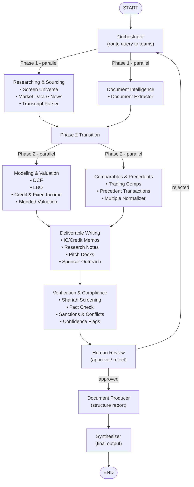
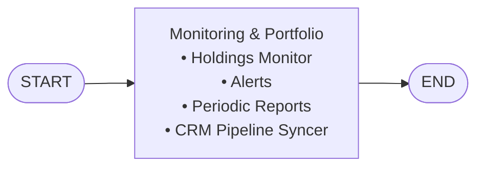

# Faheem — Fintech Multi-Agent Analysis System

> THE BEST TEAM AND PROJECT IN THE WORLD

A multi-agent financial analysis system built with **LangGraph** + **FastAPI**. Specialized teams of agents analyze different financial dimensions across phased execution, with human-in-the-loop review and compliance verification.

---

## Architecture



### Monitoring Flow



### Components

| Component | File | Role |
|---|---|---|
| **Orchestrator** | `app/graph/nodes/orchestrator.py` | Routes query to the right teams via LLM |
| **Researching & Sourcing** | `app/graph/teams/researching_sourcing/` | Screen universe, market data, earnings transcripts |
| **Document Intelligence** | `app/graph/teams/document_intelligence/` | Extract and parse financial documents |
| **Modeling & Valuation** | `app/graph/teams/modeling_valuation/` | DCF, LBO, credit analysis, blended valuation |
| **Comparables & Precedents** | `app/graph/teams/comparables_precedents/` | Trading comps, precedent transactions, multiples |
| **Deliverable Writing** | `app/graph/teams/deliverable_writing/` | Memos, research notes, pitch decks, outreach |
| **Verification & Compliance** | `app/graph/teams/verification_compliance/` | Shariah screening, fact-check, sanctions, confidence |
| **Monitoring & Portfolio** | `app/graph/teams/monitoring_portfolio/` | Holdings, alerts, periodic reports, CRM sync |
| **Human Review** | `app/graph/nodes/human_review.py` | Approve or reject with re-route to orchestrator |
| **Document Producer** | `app/graph/nodes/document_producer.py` | Structures agent outputs into a report |
| **Synthesizer** | `app/graph/nodes/synthesizer.py` | Writes the final natural-language response |
| **Controller** | `app/api/controller.py` | Orchestrates graph invocation, maps result to response |
| **Routes** | `app/api/routes.py` | HTTP endpoints (`/analyze`, `/monitor`, `/health`) |

---

## Setup

**Prerequisites:** Python 3.11+, [uv](https://docs.astral.sh/uv/)

```bash
# Install dependencies (creates .venv automatically)
uv sync

# Configure environment
cp .env.example .env
# Edit .env and add your API key
```

### Environment variables

| Variable | Default | Description |
|---|---|---|
| `LLM_PROVIDER` | `anthropic` | `anthropic` or `openai` |
| `ANTHROPIC_API_KEY` | — | Required if using Anthropic |
| `OPENAI_API_KEY` | — | Required if using OpenAI |
| `ANTHROPIC_MODEL` | `claude-sonnet-4-5` | Model name |
| `OPENAI_MODEL` | `gpt-4o` | Model name |

---

## Running

```bash
uv run uvicorn main:app --reload
```

API is available at `http://localhost:8000`. Interactive docs at `http://localhost:8000/docs`.

---

## API

### `POST /analyze`

Run a financial analysis query through the multi-agent pipeline.

**Request**
```json
{
  "query": "What is the risk profile of AAPL right now?",
  "context": {},
  "teams": ["researching_sourcing", "modeling_valuation"]
}
```

- `teams` is optional — if omitted, the orchestrator decides which teams to invoke.

**Response**
```json
{
  "request_id": "uuid",
  "final_output": "Based on the analysis...",
  "agent_results": [
    {
      "agent_name": "screen_universe",
      "analysis": "...",
      "confidence": 0.85,
      "metadata": {},
      "error": null
    }
  ],
  "report_sections": {
    "Market Analysis": "...",
    "Risk Assessment": "..."
  },
  "summary_bullets": ["Strong uptrend", "Elevated volatility"],
  "compliance_result": { "passed": true },
  "human_decision": "approved",
  "errors": []
}
```

### `POST /monitor`

Run portfolio monitoring queries.

**Request**
```json
{
  "query": "Check current holdings and alert on any threshold breaches",
  "context": {}
}
```

### `GET /health`

```json
{ "status": "ok", "timestamp": "2026-01-01T00:00:00+00:00" }
```

---

## Adding a New Agent

1. Create `app/graph/teams/<team_name>/my_agent.py`:

```python
from app.graph.teams.base_agent import BaseAnalysisAgent
from app.api.schemas import AgentOutput

class MyAgent(BaseAnalysisAgent):
    name = "my_agent"

    async def analyze(self, state) -> AgentOutput:
        # your logic here
        return AgentOutput(agent_name=self.name, analysis="...", confidence=0.8)
```

2. Register it in the team's `__init__.py` and add it to the agents list.

---

## Development

```bash
uv run pytest                  # run tests
uv run pytest --cov=app        # with coverage
uv run ruff check .            # lint
uv run ruff format .           # format
uv add <package>               # add a dependency
uv add --dev <package>         # add a dev dependency
```

---

## Project Structure

```
app/
├── api/
│   ├── controller.py          # graph invocation + response mapping
│   ├── routes.py              # HTTP endpoints
│   └── schemas.py             # Pydantic request/response models
├── core/
│   ├── config.py              # settings (pydantic-settings)
│   └── llm.py                 # LLM factory (Anthropic / OpenAI)
├── graph/
│   ├── graph.py               # StateGraph assembly (phased execution)
│   ├── state.py               # FinancialAnalysisState TypedDict
│   ├── nodes/                 # orchestrator, human_review, document_producer, synthesizer
│   └── teams/                 # 7 specialized teams with 25+ agents
│       ├── base_agent.py
│       ├── researching_sourcing/
│       ├── document_intelligence/
│       ├── modeling_valuation/
│       ├── comparables_precedents/
│       ├── deliverable_writing/
│       ├── verification_compliance/
│       └── monitoring_portfolio/
├── prompts/                   # system prompts for each team and node
data/
└── synthetic/                 # synthetic data factory for demo
```
